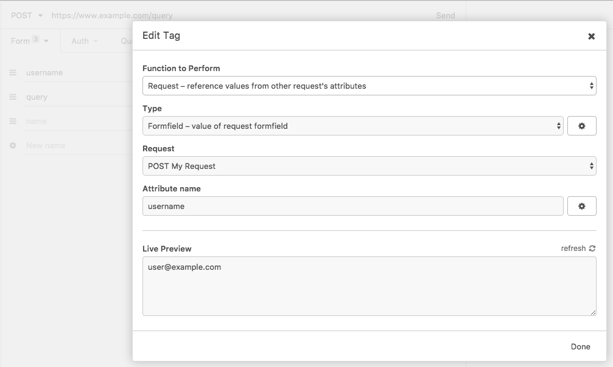
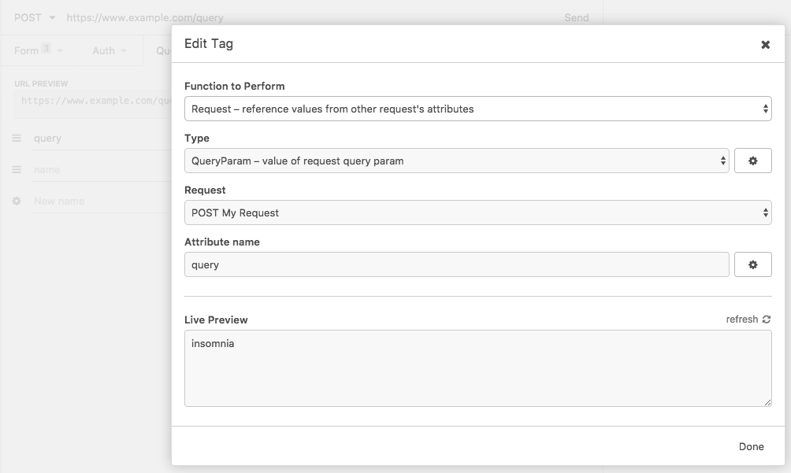
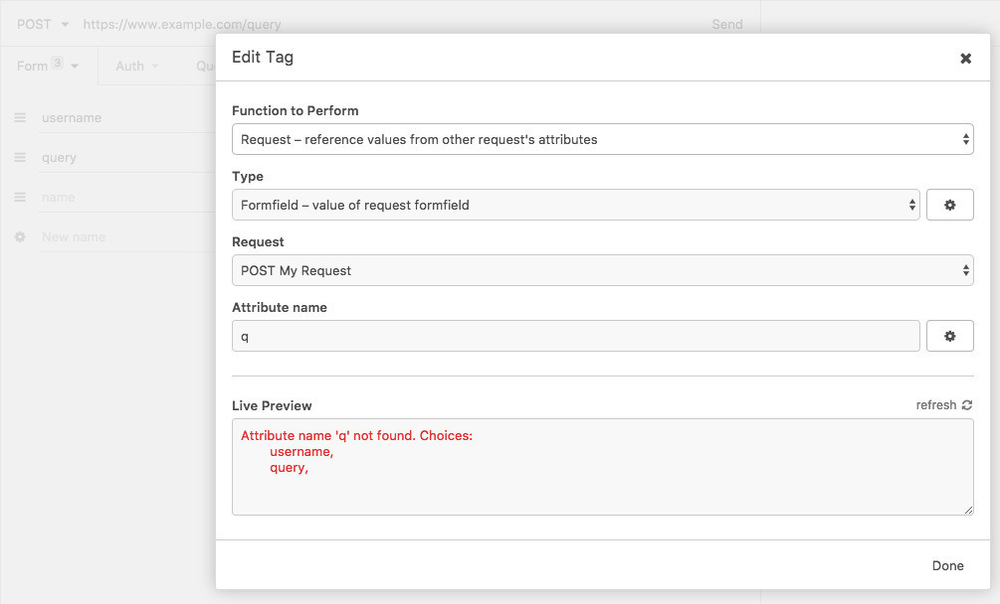

# Insomnia plugin - OtherRequest

Reference other requests attributes in [Insomnia](https://insomnia.rest/).

Build/tested for insomnia 6.0.x

## Types
### Request -> Formfield
Choose one of the active form fields of the selected request.

Enter one the choices shown in the preview as attribute name.

### Request -> Query
Choose one of the active query fields of the selected request.

Enter one the choices shown in the preview as attribute name.

## Examples
Reference a formfield attribute

Reference a query attribute

If no match was found, the avaiable fields will be displayed
